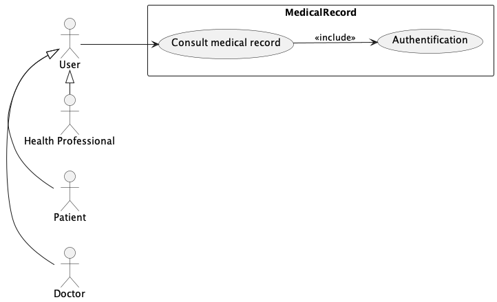
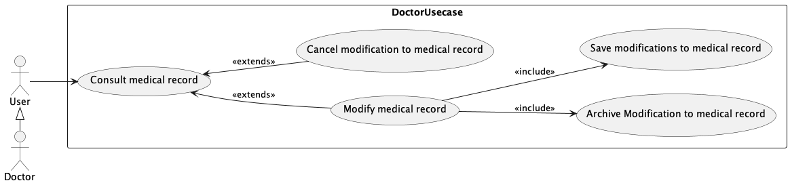
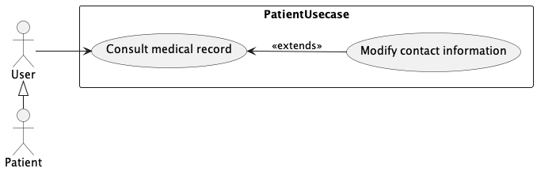
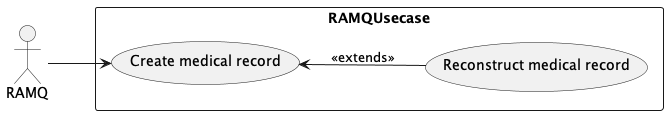
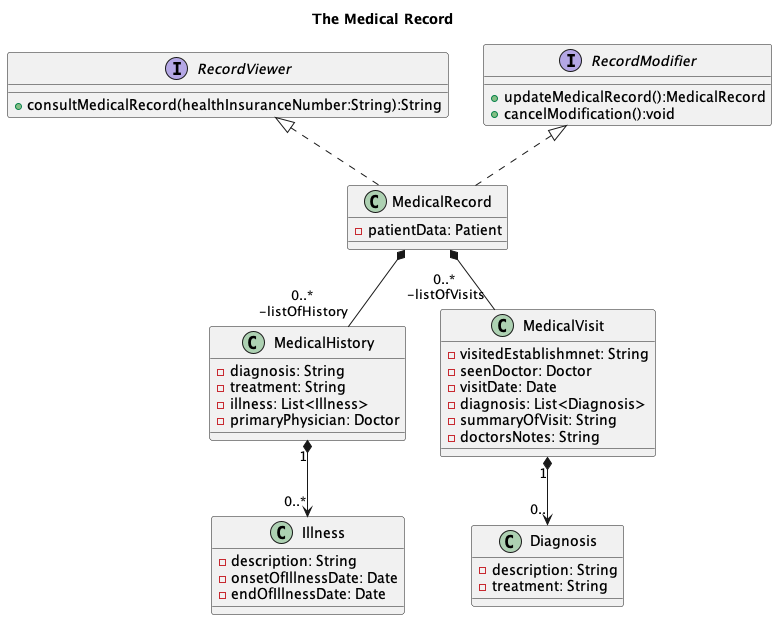

# Partie \#1

> **Notes:** Modifier la structure comme vous voulez et surtout n'hésitez pas à ajouter vos idées, de critiquer et
> d'améliorer les choses.

## Consignes (on enlèvera ça, simplement un rappel)

- Le rapport doit contenir une page de présentation et une **table des matières**.

- Il doit également contenir le texte
  nécessaire pour **introduire la modélisation** et ce qui est présenté dans chaque section du document.

- ~~Le rapport doit être un fichier markdown nommé _partie1.md_.~~

- Le rapport et le **code (PlantUml)** des diagrammes
  doivent être disponible à la racine de votre projet dans la branche principale (_main_ dans notre cas) avant le **17
  mars 2024 à 23h55**.

# Rapport du dossier médical centralisé
Le dossier médical centralisé est un logiciel permettant aux utilisateurs du système de santé québécois d'avoir un dossier médical centralisé, peu importe le médecin ou l'établissement qu'ils fréquentent. Ce rapport modélise la conception du système.

## Présenté par :

| Nom       | Prénom  | Code Permanent 
|-----------|---------|---------------|
| Montpetit | Carl    | MONC08069000  | 
| Blemur    | Lindsay | BLEL21578506  | 
| Damas     | Johanie | DAMJ73520007  | 
| Ferrat    | Yacine  | FERY14099608  |

## Table des matières
- Diagrammes de cas d'utilisation 
    - Diagramme de cas d'utilisation du dossier médical 
        - Cas d'utilisation : Consulter dossier médical
    - Diagramme de cas d'utilisation du médecin
    - Diagramme de cas d'utilisation du patient
    - Diagramme de cas d'utilisation de la RAMQ
- Diagrammes de classes
    - Vue d'ensemble des différentes classes du systèmes
    - Diagramme de classes des acteurs
        - Utilisation du patron `Polymorphisme`
    - Diagramme de classes du registre des dossiers médicaux
        - Utilisation du patron `Contrôleur`
        - Respect du patron `Créateur`
        - Justification des méthodes publiques du registre des dossiers médicaux
    - Diagramme de classes du dossier médical
        -  Utilisation du patron `Faible couplage`
        - Utilisation du patron `forte cohésion`
        - Justification des méthodes publiques du dossier médical

- Diagrammes de séquence
- Diagrammes de package
- Diagrammes de conception architecturale
    - Frontend - User interface - Application VuesJS et/ou une application Java
    - Backend - APIs RESTful - Applications Springboot
        - API Gateway
        - Microservices - SQLite3
            - API Medical Record Service
            - API Modifications Archive Service
            - API Ramq Service
            - API Authentication Service
        - Explication des microservices
    - Résumé

- Diagrammes de composants
- Diagrammes de déploiement

---
# Diagrammes de cas d'utilisation 
Cette section présente les diagrammes de cas d'utilisation modélisant les fonctionnalités du système du point de vue des acteurs.

## Diagramme de cas d'utilisation du dossier médical 

### Cas d'utilisation : Consulter dossier médical
Le médecin, le patient et le professionnel de la santé peuvent consulter le dossier médical. Chacun de ces acteurs doit s'authentifier afin d'accéder au dossier. De plus, pour consulter le dossier du patient, les utilisateurs doivent être munis de sa carte d'assurance maladie.

## Diagramme de cas d'utilisation du médecin
Lorsque le médecin accède au dossier médical du patient, il y peut apporter des modifications. Également, il peut annuler les modifications qu'il a apportées. De plus, le système sauvegarde et archive automatiquement chaque modification du dossier. 

## Diagramme de cas d'utilisation du patient
Lors de la consultation du dossier médical par un patient, ce dernier peut seulement modifier ses coordonnées.

## Diagramme de cas d'utilisation de la RAMQ
Un dossier médical est créé pour chaque personne inscrite à la RAMQ. De plus, la RAMQ peut reconstruire un dossier médical à partir d'une date donnée ou d'une modification précise faite dans le passé.

# Diagrammes de classes
Cette section présente les diagrammes de classes du système, illustrant les relations entre les différentes classes. Elle détaille également les responsabilités de chacune d'entre elles.

## Vue d'ensemble des différentes classes du systèmes

## Diagramme de classes des acteurs

### - Utilisation du patron `Polymorphisme`
Ce patron a été utilisé pour représenter les différents types d'acteurs qui intéragit avec notre système. En effet, la classe `User` hérite de la classe `Person`, les classes `Patient`, `Doctor`et `HealthProfessional` héritent de la classe `User`. 

## Diagramme de classes du registre des dossiers médicaux

### - Utilisation du patron `Contrôleur`
Ce patron a été utilisé pour coordonner les messages provenant des utilisateurs. De cette façon, la classe `User` ne pourra pas accéder directement aux données de la classe `MedicalRecord`. Ainsi, cette dernière ne pourra pas y apporter de modification.

### - Respect du patron `Créateur`
Le patron `Créateur` a été respecté dans notre modèlisation. Par exemple, la responsabilité de créer les dossiers médicaux a été confié à la classe `MedicalRecordRegistry`. Car, cette dernière est composée d'une liste de `MedicalRecord`.

### - Justification des méthodes publiques du registre des dossiers médicaux
La classe `MedicalRecordRegistry` offre les services suivants : 
- Créer un dossier médical en utilisant la méthode `createMedicalRecord()`. Elle obtient cette méthode en implémentant l'interface `RecordCreator`.
- Consulter un dossier médical en utilisant la méthode `viewMedicalRecord()`
- Obtenir un dossier médical en utilisant la méthode `getMedicalRecord()`

Ces méthodes sont publiques, car elles permettent à la classe `MedicalRecordRegistry` d'acquitter ces responsabilités.  

## Diagramme de classes du dossier médical

### - Utilisation du patron `Faible couplage`
Ce patron a été utilisé afin de minimiser les dépendances entre les objets et réduire
l’impact des changements. Par exemple, une modification dans la classe `MedicalVisit` n'affectera pas la classe `MedicalHistory`. 

### - Utilisation du patron `forte cohésion`
Nous avons attribué les responsabilités de sorte que la cohésion soit forte entre les classes. Par exemple, la classe `MedicalRecord` est composée des classes `MedicalHistory`et `MedicalVisit`. La classe `MedicalHistory` contient uniquement les informations relatives à un antécédent médical. De même, la classe `MedicalVisit` contient uniquement les données concernant une visite médicale. 

### - Justification des méthodes publiques du dossier médical
La classe `MedicalRecord` offre les services suivants : 
- Consulter un dossier médical en utilisant la méthode `consultMedicalRecord()`. Elle obtient cette méthode en implémentant l'interface `RecordViewer`.
- Modifier et supprimer les modifications apporter au dossier médical en utilisant les méthodes `updateMedicalRecord` et `cancelMedicalRecord()` en implémentant l'interface `RecordModifier`.

Ces méthodes sont publiques, car elles permettent à la classe `MedicalRecord` d'acquitter ces responsabilités.  

# Diagramme de conception architecturale
Cette section illustre le diagramme de conception architecturale de notre système, optant pour une architecture microservices pour son développement.

> TODO Si vous pouvez juste ajouter l'image du diagramme UML ici svp.

## Frontend - User interface - Application VuesJS et/ou une application Java

Tout d'abord, nous avons notre frontend développé en VueJS et/ou en Java. C'est ici que nos utilisateurs intéragissent avec notre application, bénéficiant d'une interface utilisateur conviviale et réactive.

## Backend - APIs RESTful - Applications Springboot

### API Gateway

Ensuite, nous avons notre API Gateway, qui est le point d'entrée unique pour tous nos clients. Elle gère les requêtes
clients**, **assure la sécurité avec le <u>contrôle d'accès</u>, et simplifie le traitement côté client en déplaçant la
logique d'orchestration du client vers le Gateway. Elle reçoit la requête client et effectue des actions telles que la *
*vérification des autorisations**, le **routage** de la requête vers le bon microservice, ou l'agrégation de données à
partir de plusieurs microservices si nécessaire.

**Exemple:** Si la requête concerne des informations utilisateur, elle pourrait être dirigée vers un microservice
d'authentification.

Enfin, l'API Gateway reçoit la réponse du microservice et la renvoie au client (frontend), qui affiche ensuite les
résultats à l'utilisateur.

### Microservices - SQLite3

Nous avons quatre microservices indépendants, chacun ayant sa propre base de données SQLite3 pour une isolation des
données et une scalabilité optimale. Le microservice reçoit la requête, **effectue le traitement nécessaire**, **intéragit avec sa base de données** ou **d'autres microservices si nécessaire**, et prépare la réponse. Une fois que le microservice a terminé le traitement, il renvoie la réponse à l'API Gateway.

#### API Medical Record Service

Il gère les dossiers médicaux des patients.

#### API Modifications Archive Service

Il gère l'historique des modifications apportées aux dossiers médicaux.

#### API Ramq Service

Il gère les reconstructions des dossiers médicaux et la création de nouveaux dossiers.

#### API Authentication Service

Enfin, notre Authentication Service assure la sécurité et la gestion des identités des utilisateurs.

### Explication des microservices

Chaque microservice expose une **API RESTful** avec ses propres **endpoints** pour des fonctionnalités spécifiques. Ils
communiquent entre eux de manière **asynchrone**, ce qui garantit la **scalabilité** et la **robustesse** de notre
système.

## Résumé

En résumé, notre architecture de microservices offre une **scalabilité horizontale**, une **isolation des données** et
une **flexibilité** pour <u>développer</u>, <u>déployer</u> et <u>maintenir</u> nos services de manière efficace. Ceci
implique aussi d`Ajouter plus d'unités de calcul ou de stockage en parallèle afin de répondre à une demande croissante
sans affecter négativement les performances de notre système.

Grâce à cette séparation des responsabilités, notre architecture offre une **modularité** et une **flexibilité**
accrues, permettant à chaque microservice de se concentrer sur des **tâches spécifiques** et de <u>garantir un
fonctionnement optimal</u> de l'ensemble de notre système.

# Diagramme des composants

Les diagrammes de composants sont un type de vue statique qui représente la structure du système. Un diagramme de 
composant décrit le système modélisé sous forme de composants réutilisables et met en évidence leurs relations de 
dépendances. Un composant est une entité indépendante et exécutable qui fournit des services à d'autres composants ou 
utilise des services. 

