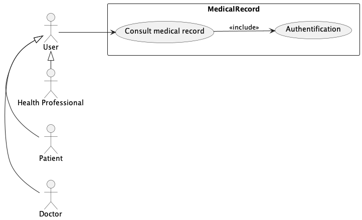
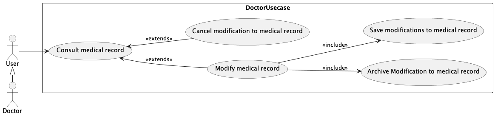
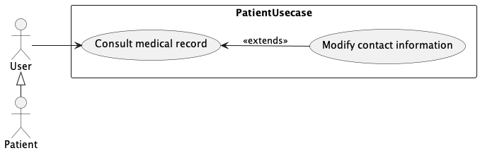
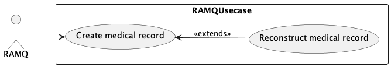

# Diagrammes de cas d'utilisation 
Cette section présente les diagrammes de cas d'utilisation modélisant les fonctionnalités du système du point de vue des acteurs.

## Diagramme de cas d'utilisation du dossier médical 

### Cas d'utilisation : Consulter dossier médical
Le médecin, le patient et le professionnel de la santé peuvent consulter le dossier médical. Chacun de ces acteurs doit s'authentifier afin d'accéder au dossier. De plus, pour consulter le dossier du patient, le médecin et le professionnel de la santé doivent être munis de sa carte d'assurance maladie.

## Diagramme de cas d'utilisation du médecin
Lorsque le médecin accède au dossier médical du patient, il y peut apporter des modifications. Également, il peut annuler les modifications qu'il a apportées. De plus, le système sauvegarde et archive automatiquement chaque modification du dossier. 

## Diagramme de cas d'utilisation du patient
Lors de la consultation du dossier médical par un patient, ce dernier peut seulement modifier ses coordonnées.

## Diagramme de cas d'utilisation de la RAMQ
Un dossier médical est créé pour chaque personne inscrite à la RAMQ. De plus, la RAMQ peut reconstruire un dossier médical à partir d'une date donnée ou d'une modification précise faite dans le passé.

