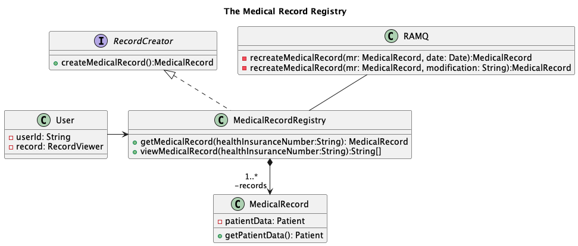
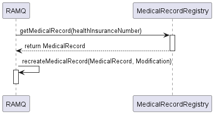
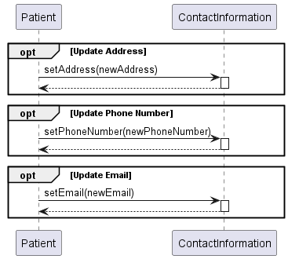
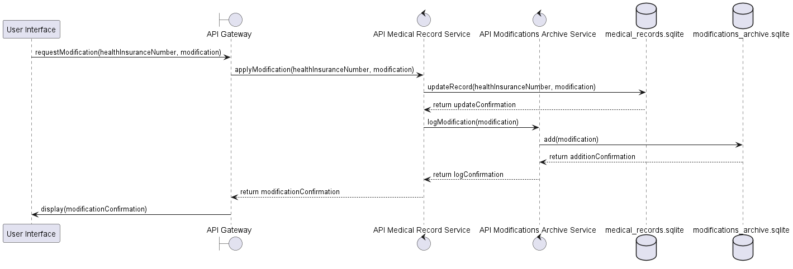
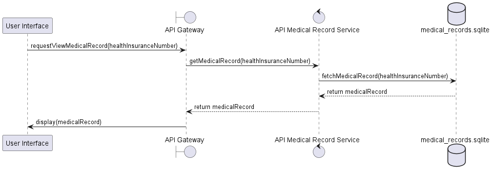

# Partie \#1

> **Notes:** Modifier la structure comme vous voulez et surtout n'hésitez pas à ajouter vos idées, de critiquer et
> d'améliorer les choses.

## Consignes (on enlèvera ça, simplement un rappel)

- Le rapport doit contenir une page de présentation et une **table des matières**.

- Il doit également contenir le texte
  nécessaire pour **introduire la modélisation** et ce qui est présenté dans chaque section du document.

- ~~Le rapport doit être un fichier markdown nommé _partie1.md_.~~

- Le rapport et le **code (PlantUml)** des diagrammes
  doivent être disponible à la racine de votre projet dans la branche principale (_main_ dans notre cas) avant le **17
  mars 2024 à 23h55**.

# Rapport du dossier médical centralisé
Le dossier médical centralisé est un logiciel permettant aux utilisateurs du système de santé québécois d'avoir un dossier médical centralisé, peu importe le médecin ou l'établissement qu'ils fréquentent. Ce rapport modélise la conception du système.

## Présenté par :

| Nom       | Prénom  | Code Permanent 
|-----------|---------|---------------|
| Montpetit | Carl    | MONC08069000  | 
| Blemur    | Lindsay | BLEL21578506  | 
| Damas     | Johanie | DAMJ73520007  | 
| Ferrat    | Yacine  | FERY14099608  |

## Table des matières
- [Diagrammes de cas d'utilisation](#usecase-main) 
    - Diagramme de cas d'utilisation du dossier médical 
        - Cas d'utilisation : Consulter dossier médical
    - Diagramme de cas d'utilisation du médecin
    - Diagramme de cas d'utilisation du patient
    - Diagramme de cas d'utilisation de la RAMQ
- [Diagrammes de classes](#class-main)
    - Vue d'ensemble des différentes classes du systèmes
    - Diagramme de classes des acteurs
        - Utilisation du patron `Polymorphisme`
    - Diagramme de classes du registre des dossiers médicaux
        - Utilisation du patron `Contrôleur`
        - Respect du patron `Créateur`
        - Justification des méthodes publiques du registre des dossiers médicaux
    - Diagramme de classes du dossier médical
        -  Utilisation du patron `Faible couplage`
        - Utilisation du patron `forte cohésion`
        - Justification des méthodes publiques du dossier médical

- Diagrammes de séquence
- Diagrammes de package
- [Diagrammes de conception architecturale](#architecture-main)
    - Frontend - User interface - Application VuesJS et/ou une application Java
    - Backend - APIs RESTful - Applications Springboot
        - API Gateway
        - Microservices - SQLite3
            - API Medical Record Service
            - API Modifications Archive Service
            - API Ramq Service
            - API Authentication Service
        - Explication des microservices
    - Résumé

- [Diagrammes de composants](#composant-main)
- Diagrammes de déploiement

---
# Diagrammes de cas d'utilisation 

Cette section présente les diagrammes de cas d'utilisation modélisant les fonctionnalités du système du point de vue des acteurs.

## Diagramme de cas d'utilisation du dossier médical 

### Cas d'utilisation : Consulter dossier médical
Le médecin, le patient et le professionnel de la santé peuvent consulter le dossier médical. Chacun de ces acteurs doit s'authentifier afin d'accéder au dossier. De plus, pour consulter le dossier du patient, les utilisateurs doivent être munis de sa carte d'assurance maladie.

## Diagramme de cas d'utilisation du médecin
Lorsque le médecin accède au dossier médical du patient, il y peut apporter des modifications. Également, il peut annuler les modifications qu'il a apportées. De plus, le système sauvegarde et archive automatiquement chaque modification du dossier. 

## Diagramme de cas d'utilisation du patient
Lors de la consultation du dossier médical par un patient, ce dernier peut seulement modifier ses coordonnées.

## Diagramme de cas d'utilisation de la RAMQ
Un dossier médical est créé pour chaque personne inscrite à la RAMQ. De plus, la RAMQ peut reconstruire un dossier médical à partir d'une date donnée ou d'une modification précise faite dans le passé.

# Diagrammes de classes

Cette section présente les diagrammes de classes du système, illustrant les relations entre les différentes classes. Elle détaille également les responsabilités de chacune d'entre elles.

## Vue d'ensemble des différentes classes du systèmes

## Diagramme de classes des acteurs

### - Utilisation du patron `Polymorphisme`
Ce patron a été utilisé pour représenter les différents types d'acteurs qui intéragit avec notre système. En effet, la classe `User` hérite de la classe `Person`, les classes `Patient`, `Doctor`et `HealthProfessional` héritent de la classe `User`. 

## Diagramme de classes du registre des dossiers médicaux

### - Utilisation du patron `Contrôleur`
Ce patron a été utilisé pour coordonner les messages provenant des utilisateurs. De cette façon, la classe `User` ne pourra pas accéder directement aux données de la classe `MedicalRecord`. Ainsi, cette dernière ne pourra pas y apporter de modification.

### - Respect du patron `Créateur`
Le patron `Créateur` a été respecté dans notre modèlisation. Par exemple, la responsabilité de créer les dossiers médicaux a été confié à la classe `MedicalRecordRegistry`. Car, cette dernière est composée d'une liste de `MedicalRecord`.

### - Justification des méthodes publiques du registre des dossiers médicaux
La classe `MedicalRecordRegistry` offre les services suivants : 
- Créer un dossier médical en utilisant la méthode `createMedicalRecord()`. Elle obtient cette méthode en implémentant l'interface `RecordCreator`.
- Consulter un dossier médical en utilisant la méthode `viewMedicalRecord()`
- Obtenir un dossier médical en utilisant la méthode `getMedicalRecord()`

Ces méthodes sont publiques, car elles permettent à la classe `MedicalRecordRegistry` d'acquitter ces responsabilités.  

## Diagramme de classes du dossier médical

### - Utilisation du patron `Faible couplage`
Ce patron a été utilisé afin de minimiser les dépendances entre les objets et réduire
l’impact des changements. Par exemple, une modification dans la classe `MedicalVisit` n'affectera pas la classe `MedicalHistory`. 

### - Utilisation du patron `forte cohésion`
Nous avons attribué les responsabilités de sorte que la cohésion soit forte entre les classes. Par exemple, la classe `MedicalRecord` est composée des classes `MedicalHistory`et `MedicalVisit`. La classe `MedicalHistory` contient uniquement les informations relatives à un antécédent médical. De même, la classe `MedicalVisit` contient uniquement les données concernant une visite médicale. 

### - Justification des méthodes publiques du dossier médical
La classe `MedicalRecord` offre les services suivants : 
- Consulter un dossier médical en utilisant la méthode `consultMedicalRecord()`. Elle obtient cette méthode en implémentant l'interface `RecordViewer`.
- Modifier et supprimer les modifications apporter au dossier médical en utilisant les méthodes `updateMedicalRecord` et `cancelMedicalRecord()` en implémentant l'interface `RecordModifier`.

Ces méthodes sont publiques, car elles permettent à la classe `MedicalRecord` d'acquitter ces responsabilités.

# Diagrammes de Séquence pour les interactions entre les classes

Ces diagrammes de séquence illustrent différents aspects de l'interaction entre les classes de  l'application de gestion des dossiers médicaux.

## 1. Consultation d'un dossier médical

### Participants
- Utilisateur (User)
- Registre des Dossiers Médicaux (Medical Record Registry)
- Dossier Médical (Medical Record)

### Processus
L'utilisateur demande à consulter un dossier médical par son numéro d'assurance maladie. Le registre cherche et retrouve le dossier correspondant, puis déclenche la consultation du dossier. Enfin, les informations du dossier médical sont affichées à l'utilisateur.

### Justification
Ce processus garantit que les informations médicales sont accessibles rapidement et de manière sécurisée. L'activation et la désactivation des composants illustrent le contrôle de flux et la gestion des ressources, assurant ainsi que le système est efficace et sécurisé.

## 2. Mise à jour d'un dossier médical par un médecin

### Participants
- Médecin (Doctor)
- Registre des Dossiers Médicaux (MedicalRecordRegistry)
- Dossier Médical (MedicalRecord)

### Processus
Le médecin demande le dossier médical d'un patient. Une fois reçu, il procède à la mise à jour du dossier. La confirmation de la mise à jour est ensuite renvoyée au médecin.

### Justification
Ce diagramme montre l'importance de maintenir les dossiers médicaux à jour pour la prise en charge des patients. Le passage par le registre assure l'intégrité et la centralisation des données.

## 3. Annulation d'une modification d'un dossier médical par un médecin

### Processus et participants
Similaires au diagramme de mise à jour.

### Justification
Ce scénario souligne la flexibilité du système en permettant aux médecins d'annuler des modifications. Cela peut être crucial en cas d'erreur de saisie ou de changement d'avis, contribuant ainsi à l'exactitude des dossiers médicaux.

## 4. Création d'un dossier médical

### Participants
- RAMQ
- Registre des Dossiers Médicaux (MedicalRecordRegistry)

### Processus
La RAMQ envoie une demande de création d'un nouveau dossier médical. Le registre traite cette demande et confirme la création.

### Justification
Ce processus illustre la collaboration entre la RAMQ et le registre pour assurer que chaque citoyen dispose d'un dossier médical, facilitant ainsi la gestion de la santé publique.

## 5. & 6. Recréation d'un dossier médical

### Participants
- RAMQ
- Registre des Dossiers Médicaux (MedicalRecordRegistry)

### Processus
Après avoir récupéré un dossier médical, la RAMQ effectue une opération de recréation du dossier, soit en spécifiant une date, soit une modification particulière.

### Justification
Ces diagrammes peuvent refléter des scénarios où il est nécessaire de restaurer ou de mettre à jour un dossier médical à la suite d'une perte de données ou d'une correction d'erreurs, assurant ainsi l'intégrité et la continuité des soins.

## 7. Mise à jour des informations de contact d'un patient

### Participants
- Patient
- Informations de Contact (ContactInformation)

### Processus
Le patient met à jour ses informations de contact (adresse, numéro de téléphone, email) au besoin.

### Justification
Ce processus est essentiel pour maintenir une communication efficace entre les patients et les prestataires de soins de santé. La possibilité de mettre à jour ces informations de manière indépendante par le patient souligne l'importance de l'autonomie du patient et de la précision des données dans le système de santé.

# Diagrammes de Séquence pour les interactions entre les APIs

Les diagrammes de séquence suivants représentent différentes opérations réalisées au sein de l'application de gestion des dossiers médicaux. Ils illustrent les interactions entre l'interface utilisateur, les gateways, les services d'API, les bases de données, et les services d'archivage.

## 1. Création de dossier médical

**Interactions :** L'utilisateur initie la demande de création d'un dossier médical via l'interface utilisateur. Cette demande est transmise à travers un API Gateway qui relaye la demande au service API Ramq, lequel crée le dossier et le sauvegarde via le service API des dossiers médicaux. Enfin, le dossier est ajouté à la base de données des dossiers médicaux.

**Justification :** Ce flux garantit une séparation claire des responsabilités entre les différents services et permet une meilleure modularité et sécurité. L'utilisation d'un API Gateway facilite la gestion des requêtes et la sécurisation des accès.

## 2. Reconstitution de dossier à partir de modifications

**Interactions :** À la demande de l'utilisateur, le système récupère une modification spécifique via l'API Gateway et le service API Ramq, qui demande ensuite au service des dossiers médicaux de récupérer cette modification dans le service d'archivage des modifications. Le dossier médical est reconstruit à partir de cette modification et sauvegardé dans une base de données dédiée.

**Justification :** Ce processus permet de retracer et d'appliquer des modifications spécifiques à un dossier médical existant, assurant ainsi l'intégrité des données et la possibilité de revenir à un état antérieur si nécessaire.

## 3. Reconstitution de dossier à partir d'une date

**Interactions :** L'utilisateur demande la reconstitution d'un dossier à partir d'une date donnée. Le service API Ramq récupère les données pertinentes pour cette date et les traite pour reconstruire le dossier, qui est ensuite sauvegardé dans une copie de base de données.

**Justification :** Ce flux est utile pour restaurer l'état d'un dossier médical à un moment précis, permettant une flexibilité et une gestion efficace des historiques de dossiers médicaux.

## 4. Application d'une modification sur un dossier

**Interactions :** Une modification est demandée par l'utilisateur et traitée par le service des dossiers médicaux, qui met à jour le dossier dans la base de données et enregistre la modification dans le service d'archive des modifications.

**Justification :** Ce processus assure que toutes les modifications apportées à un dossier sont correctement enregistrées et traçables, ce qui est crucial pour la gestion des données médicales et leur intégrité.

## 5. Annulation d'une modification de dossier

**Interactions :** Sur demande de l'utilisateur, une modification spécifique d'un dossier est annulée. Le dossier est mis à jour pour refléter l'annulation, et la modification est supprimée de l'archive des modifications.

**Justification :** Ce mécanisme permet de gérer efficacement les erreurs ou les changements d'avis en permettant l'annulation de modifications précédemment appliquées, garantissant ainsi la flexibilité et la correction des données.

## 6. Authentification d'utilisateur

**Interactions :** L'utilisateur soumet ses identifiants via l'interface, qui sont vérifiés par le service d'authentification. En cas de succès, un jeton d'accès est généré et retourné à l'utilisateur. En cas d'échec, un message d'erreur est affiché.

**Justification :** Ce processus est essentiel pour sécuriser l'accès au système, en s'assurant que seuls les utilisateurs autorisés peuvent effectuer des opérations sensibles ou accéder à des informations confidentielles.

## 7. Visualisation de dossier médical

**Interactions :** L'utilisateur initie une demande de visualisation d'un dossier médical en fournissant un numéro d'assurance maladie via l'interface utilisateur. Cette demande est transmise à travers un API Gateway vers le service API des dossiers médicaux. Le service interroge ensuite la base de données des dossiers médicaux pour récupérer le dossier correspondant au numéro fourni. Une fois le dossier médical récupéré, il est retourné à l'API Gateway, puis à l'interface utilisateur qui l'affiche.

**Justification :** Ce flux illustre une opération de consultation de données sécurisée et efficace. L'utilisation d'un API Gateway centralise les requêtes et renforce la sécurité en contrôlant l'accès aux services internes. Le service API des dossiers médicaux agit comme un intermédiaire entre la base de données et l'interface utilisateur, permettant une abstraction de la logique d'accès aux données et facilitant d'éventuelles évolutions du système de stockage des données. Cette séparation des responsabilités assure une meilleure maintenance du système et une plus grande sécurité des données sensibles, en limitant l'accès direct à la base de données. La demande de visualisation d'un dossier médical est une fonctionnalité essentielle dans les systèmes de gestion des dossiers médicaux, permettant aux utilisateurs autorisés d'accéder rapidement et de façon sécurisée aux informations médicales nécessaires.

# Diagramme de conception architecturale

Cette section illustre le diagramme de conception architecturale de notre système, optant pour une architecture microservices pour son développement.

## Frontend - User interface - Application VuesJS et/ou une application Java

Tout d'abord, nous avons notre frontend développé en VueJS et/ou en Java. C'est ici que nos utilisateurs intéragissent avec notre application, bénéficiant d'une interface utilisateur conviviale et réactive.

## Backend - APIs RESTful - Applications Springboot

### API Gateway

Ensuite, nous avons notre API Gateway, qui est le point d'entrée unique pour tous nos clients. Elle gère les requêtes
clients**, **assure la sécurité avec le <u>contrôle d'accès</u>, et simplifie le traitement côté client en déplaçant la
logique d'orchestration du client vers le Gateway. Elle reçoit la requête client et effectue des actions telles que la *
*vérification des autorisations**, le **routage** de la requête vers le bon microservice, ou l'agrégation de données à
partir de plusieurs microservices si nécessaire.

**Exemple:** Si la requête concerne des informations utilisateur, elle pourrait être dirigée vers un microservice
d'authentification.

Enfin, l'API Gateway reçoit la réponse du microservice et la renvoie au client (frontend), qui affiche ensuite les
résultats à l'utilisateur.

### Microservices - SQLite3

Nous avons quatre microservices indépendants, chacun ayant sa propre base de données SQLite3 pour une isolation des
données et une scalabilité optimale. Le microservice reçoit la requête, **effectue le traitement nécessaire**, **intéragit avec sa base de données** ou **d'autres microservices si nécessaire**, et prépare la réponse. Une fois que le microservice a terminé le traitement, il renvoie la réponse à l'API Gateway.

#### API Medical Record Service

Il gère les dossiers médicaux des patients.

#### API Modifications Archive Service

Il gère l'historique des modifications apportées aux dossiers médicaux.

#### API Ramq Service

Il gère les reconstructions des dossiers médicaux et la création de nouveaux dossiers.

#### API Authentication Service

Enfin, notre Authentication Service assure la sécurité et la gestion des identités des utilisateurs.

### Explication des microservices

Chaque microservice expose une **API RESTful** avec ses propres **endpoints** pour des fonctionnalités spécifiques. Ils
communiquent entre eux de manière **asynchrone**, ce qui garantit la **scalabilité** et la **robustesse** de notre
système.

## Résumé

En résumé, notre architecture de microservices offre une **scalabilité horizontale**, une **isolation des données** et
une **flexibilité** pour <u>développer</u>, <u>déployer</u> et <u>maintenir</u> nos services de manière efficace. Ceci
implique aussi d`Ajouter plus d'unités de calcul ou de stockage en parallèle afin de répondre à une demande croissante
sans affecter négativement les performances de notre système.

Grâce à cette séparation des responsabilités, notre architecture offre une **modularité** et une **flexibilité**
accrues, permettant à chaque microservice de se concentrer sur des **tâches spécifiques** et de <u>garantir un
fonctionnement optimal</u> de l'ensemble de notre système.

# Diagramme des composants

Les diagrammes de composants sont un type de vue statique qui représente la structure du système. Un diagramme de 
composant décrit le système modélisé sous forme de composants réutilisables et met en évidence leurs relations de 
dépendances. Un composant est une entité indépendante et exécutable qui fournit des services à d'autres composants ou 
utilise des services. 

