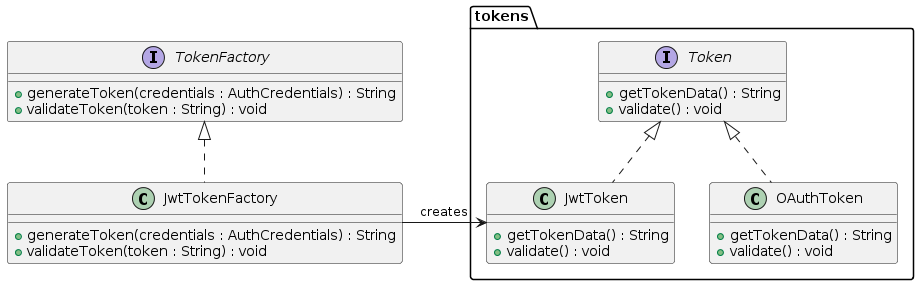

# Partie \#2

# Dossier Médical Centralisé
## INF5153 - Génie logiciel : Conception - HIVER 2024
### UQAM - Département Informatique - Groupe 30
#### Sous la supervision de Serge Dogny

---

# Rapport du dossier médical centralisé
Le dossier médical centralisé est un logiciel permettant aux utilisateurs du système de santé québécois d'avoir un dossier médical centralisé, peu importe le médecin ou l'établissement qu'ils fréquentent. Ce rapport modélise la conception du système.

## Présenté par :

| Nom       | Prénom  | Code Permanent 
|-----------|---------|---------------|
| Montpetit | Carl    | MONC08069000  | 
| Blemur    | Lindsay | BLEL21578506  | 
| Damas     | Johanie | DAMJ73520007  | 
| Ferrat    | Yacine  | FERY14099608  |

## Table des matières
- Patron Strategy
  - Diagramme de classes
  - Diagrammes de séquence
- Patron Factory
  - Diagramme de classes
  - Diagrammes de séquence
- Patron Proxy
  - Diagramme de classes
  - Diagrammes de séquence
- Patron Builder
  - Diagramme de classes
  - Diagramme de séquence

---

# Patron Strategy
Nous avons utilisé le patron `Strategy` pour permettre au médecin de télécharger le dossier du patient en format Json ou Txt. 
Ainsi, le code est évolutif et on pourrait ajouter d'autres formats à l'avenir.

## Diagramme de classe 

## Diagrammes de séquence
### Json Strategy

### Txt Strategy

---

# Patron Factory
## Problème
Les applications web doivent intégrer plusieurs méthodes d'authentification pour répondre aux besoins diversifiés des utilisateurs et des systèmes externes. L'intégration de méthodes variées comme les identifiants traditionnels et les services OAuth présente des défis en matière de gestion sécurisée et unifiée des flux d'authentification et des jetons.

## Adopter le patron Factory
Le patron Factory abstrait la création des objets (jetons dans ce cas) en isolant le code de création du code d'utilisation. Cela permet d'étendre et de modifier les types de jetons supportés sans impacter le reste du système. Il favorise l'encapsulation, la flexibilité et la maintenabilité en définissant une interface commune pour la création d'objets, facilitant ainsi l'ajout de nouveaux types de jetons ou méthodes d'authentification.

## Diagramme de classe

## Description du Diagramme de Classes

**TokenFactory et JwtTokenFactory** : Interfaces et classes qui définissent comment les jetons sont générés et validés. JwtTokenFactory crée des instances de JwtToken.  
**Token, JwtToken, OAuthToken** : Interfaces et classes pour les jetons. Chaque classe de jeton implémente les méthodes pour obtenir et valider les données du jeton.  
**Association** : JwtTokenFactory crée des JwtToken, illustrant la spécialisation de la factory pour un type spécifique de jeton.

## Diagrammes de séquence

## Description des Diagrammes de Séquence

### Génération de Jetons
**Composants** : AuthController, AuthService, TokenFactory, Token  
**Flux** : Le Client demande un jeton via AuthController, qui délègue la création à AuthService. AuthService utilise TokenFactory pour générer un jeton, qui est ensuite retourné au client.

### Validation de Jetons
**Flux** : Le Client demande la validation d'un jeton. AuthController transmet la demande à AuthService, qui utilise TokenFactory pour valider le jeton. Le résultat est renvoyé au client.

---

# Patron Proxy

> Dans notre API Gateway, nous avons intégré quatre types de proxies: l'authentification, la journalisation, le contrôle du débit et la traçabilité.
>
> Ces proxies agissent comme des filtres qui interceptent les requêtes entrantes et sortantes, leur permettant d'<u>ajouter des fonctionnalités supplémentaires sans modifier le comportement de l'API</u> elle-même.

1. **Journalisation** : Affiche des informations pertinentes concernant les requêtes entrantes et sortantes. Suivre et analyser le flux de données dans le système, facilitant ainsi le <u>débogage</u> et la <u>surveillance</u> des performances.
2. **Authentification** : Gérer les autorisations et les permissions d'accès aux ressources, garantissant ainsi la sécurité et la confidentialité des données.
  - **Vérification rapide de jeton** : Valider les jetons d'authentification ou d'accès, permettant un contrôle d'accès efficace aux ressources protégées.
3. **Ajout d’en-tête dans les requêtes** : Suivre les requêtes entrantes et sortantes, fournissant ainsi une traçabilité et une analyse approfondie du flux de données.
4. **Limitation du nombre de requêtes par adresse IP** : Dans un intervalle de temps donné (dans notre cas maximum 30 par minute par IP), ce qui aide à prévenir les attaques de déni de service.

Nous avont décidé d'utiliser le proxy journalisation pour présenter les détails du patron.

## Proxy - Journalisation

### **Présentation du Diagramme de Classe**

Voyons maintenant les principaux éléments de notre diagramme:

1. **GatewayAPI (Sujet)**: Il s'agit de notre API Gateway, qui est le point d'entrée principal de notre système. Il expose une méthode `sendRequest()` pour envoyer des requêtes.
2. **LoggingFilter (Proxy)**: Ce proxy est responsable de la journalisation des requêtes entrantes et sortantes. Il <u>intercepte les requêtes et réponses</u>, enregistre les détails pertinents et laisse passer la requête vers le système sous-jacent.
3. **GatewayFilter (Sujet Réel)**: C'est l'interface qui définit le comportement des filtres réels utilisés par notre API Gateway. Dans notre cas, LoggingFilter implémente cette interface.
4. **Logger (Utilitaire)**: Il s'agit d'un utilitaire de journalisation utilisé par le LoggingFilter pour enregistrer les messages de journalisation.
5. **AbstractGatewayFilterFactory (Usine)**: Cette classe est une usine abstraite qui crée différents types de filtres en fonction de la configuration fournie.

> Ces classes interagissent de manière à intercepter les requêtes, à ajouter des fonctionnalités supplémentaires telles que la journalisation et à laisser passer les requêtes vers le système sous-jacent.

### **Présentation du Diagramme de Séquence**

> Dans notre cas, nous allons nous concentrer sur **le scénario** où <u>une requête est interceptée par le proxy</u> de journalisation (`LoggingFilter`)  présent dans l’``API Gateway` avant d'être transmise au système sous-jacent.

Voici les étapes principales de ce scénario:

1. `Client` (Frontend) envoie une requête à notre `API Gateway`.
2. `Gateway API` intercepte la requête et applique automatiquement le proxy de journalisation.
3. Le `LoggingFilter` (Proxy) est activé et enregistre les détails de la requête entrante, tels que la méthode `HTTP` et l'`URI` (Identifiant Uniforme de Ressource).
4. La requête est ensuite transmise au système sous-jacent via la méthode `filter()` de `GatewayFilter` (Sujet Réel).
5. Le système traite la requête et génère une réponse.
6. La réponse est renvoyée à `LoggingFilter`, qui enregistre également <u>les détails</u> de la réponse sortante.
7. Finalement, la réponse est renvoyée au `Client` (Frontend).

**Motivation :** Ce processus permet à notre système de <u>garder une trace détaillée</u> de toutes les requêtes et réponses, ce qui est précieux pour le débogage, la surveillance et l'analyse des performances.

# Patron Builder

